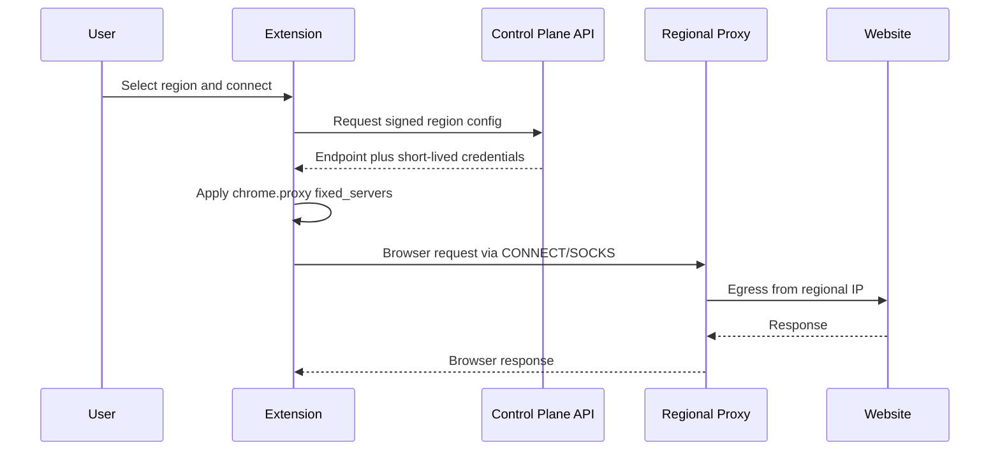

# VeilRoute Architecture

## Product Shape

VeilRoute has two viable product tiers:

1. Browser proxy tier: a Chromium extension uses `chrome.proxy` to send browser traffic through region-specific proxy gateways.
2. Full VPN tier: native macOS, Windows, iOS, and Android apps use WireGuard or another OS VPN tunnel. The browser extension can control account state and region preference, but not device-level routing.

## Components

### Extension

- Fetches signed region metadata from the API.
- Stores only the active region, enabled state, and short-lived proxy credentials.
- Applies Chrome proxy settings with `fixed_servers`.
- Responds to proxy authentication challenges with scoped credentials.
- Optionally sets Chrome WebRTC handling to reduce direct IP exposure.

### Control Plane API

- Authenticates users and devices.
- Returns healthy regions ranked by latency, load, and account entitlement.
- Issues short-lived proxy credentials per user, device, and region.
- Receives anonymized gateway health metrics.
- Revokes credentials when sessions expire or abuse is detected.

### Regional Gateway

Each region should run at least two gateways behind a regional load balancer.

Recommended baseline:

- HTTPS CONNECT proxy on TCP 443.
- SOCKS5 proxy on TCP 1080 or 443 where supported.
- Egress NAT with region-owned IP pools.
- Strict no-content-logging defaults.
- Rate limiting and abuse controls keyed by ephemeral credential ID.
- Health endpoint reachable only from the control plane.

### Observability

Track service health without tracking browsing content:

- Gateway up/down.
- Aggregate bandwidth.
- Active sessions by region.
- Authentication failures.
- Abuse signals.
- Control-plane latency.

Do not log full URLs, DNS queries, request bodies, account browsing history, or destination IPs unless a clearly documented enterprise/legal mode requires it.

## Request Flow



## Deployment Layout

```text
global
  control-plane-api
  auth-provider
  billing-provider
  telemetry-store
  config-signer

regions
  us-nyc
    gateway-a
    gateway-b
    regional-lb
    egress-ip-pool
  gb-lon
    gateway-a
    gateway-b
    regional-lb
    egress-ip-pool
  sg-sin
    gateway-a
    gateway-b
    regional-lb
    egress-ip-pool
```

## Data Model

- `Region`: id, country, city, endpoint, supported protocols, health, load, tags.
- `Device`: user id, installation id, public key, last seen, entitlement.
- `ProxyCredential`: credential id, region id, username, password hash, expires at, bandwidth cap.
- `Session`: credential id, region id, connected at, disconnected at, aggregate bytes.

## Production Hardening

- Use short-lived proxy credentials and rotate them frequently.
- Sign region configuration responses.
- Pin API TLS certificates only if you have a reliable rotation strategy.
- Keep proxy credentials out of sync storage.
- Use per-region circuit breakers when health drops.
- Provide a kill switch option, but explain it only covers browser traffic for the extension tier.
